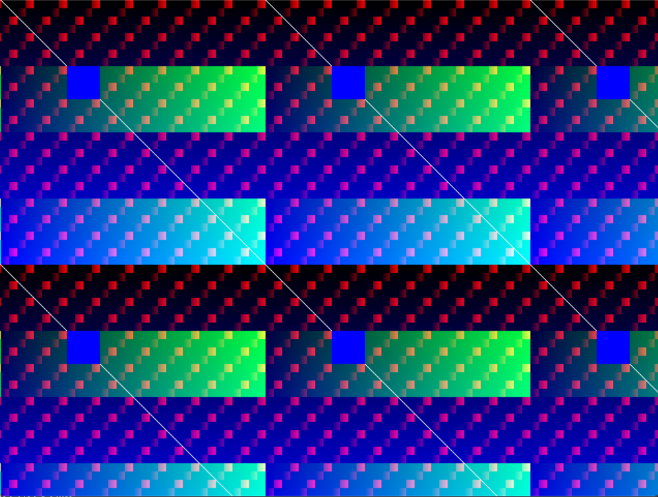
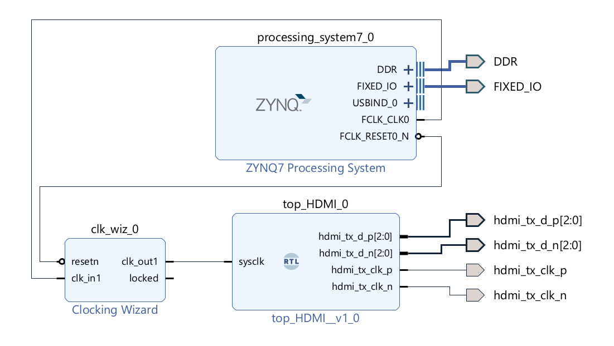

# HDMI Test Pattern Generator

What does it do?  
A simple FPGA application which displays a test pattern.



Runs on:

- MiSTer FPGA (DE10 Nano)
- Pynq Z2
- Verilator

## Source Code/Logic for Pattern Generation

```systemverilog
module VIDEO_test_pattern #(
    COORDSPC = 16,  // coordinate space (bits)
    COLSPC   = 10
) (
    input wire clk,
    input wire signed [COORDSPC-1:0] beam_x,
    input wire signed [COORDSPC-1:0] beam_y,
    output logic [COLSPC-1:0] red,
    output logic [COLSPC-1:0] green,
    output logic [COLSPC-1:0] blue
);
  wire [COLSPC-1:0] SX = beam_x[COLSPC-1:0];
  wire [COLSPC-1:0] SY = beam_y[COLSPC-1:0];
  wire [COLSPC-1:0] W = {COLSPC{SX[7:0] == SY[7:0]}};
  wire [COLSPC-1:0] A = {COLSPC{SX[7:5] == 3'h2 && SY[7:5] == 3'h2}};

  always_ff @(posedge clk) begin
    red   <= ({SX[5:0] & {6{SY[4:3] == ~SX[4:3]}}, 4'b0} | W) & ~A;
    green <= (SX & {COLSPC{SY[6]}} | W) & ~A;
    blue  <= SY | W | A;
  end
endmodule
```

## Getting started

NOTE: run all scripts from the root folder

## MiSTer FPGA Project

```sh
mkdir config
cp app/mister/scripts/__mister_config config/.
nano ./config/__mister_config
# change as required
```

```sh
# create the quartus project
./app/mister/scripts/create.sh
# build the project
./app/mister/scripts/build.sh
# copy the *.rbf file 
# to the mister device
# configured in ./config/__mister_config
./app/mister/scripts/scp-rbf
```

On the mister device, select and launch  
_PROJECTS/hdmi_overlay_mister  
(Set in ./config/__mister_config)

### MiSTer FPGA Project Prerequisites

- Quartus 17 Lite 

## Pynq Z2 Project



```sh
# create, then build the vivado project
./app/pynq_z2_hw/scripts/create.sh
./app/pynq_z2_hw/scripts/build.sh

# create, then build the vitis project
./app/pynq_z2_fw/scripts/create.sh
./app/pynq_z2_fw/scripts/build.sh

# copy the BOOT.bin file to a bootable SD card
# mounted at /d
./app/pynq_z2_fw/scripts/cp-boot-bin.sh /d
```

### Pynq Z2 Project Prerequisites

- Xilinx toolsuite
- Tested on v2023.2, v2024.2

## Verilator

```sh
# create, then run the verilator project
./app/verilator/scripts/build.sh
./app/verilator/scripts/run.sh
```

### Verilator Project Prerequisites

- Verilator
- SDL3 or SDL2
- Cmake or Make (CMake recommended)
- Project defaults to SDL3 + CMake

## General Change Management Principles

Anything under ./app is versioned.  
Anything outside of ./app is not.  
Apart from .gitignore and README.md.

## Project Structure

```test
├── app
│   ├── docs
│   ├── mister          <-- mister project, source, scripts
│   ├── pynq_z2_env.sh  <-- Xilinx configurations settings
│   ├── pynq_z2_fw      <-- vitis project, source, scripts
│   ├── pynq_z2_hw      <-- vivado project, source, scripts
│   ├── TODO.md
│   ├── verilator       <-- verilator project, source, scripts
│   ├── hdl             <-- shared FPGA application code
│   ├── xilinx_env.tcl  <-- pynq_z2_env.sh -> tcl variables
│   ├── z_turn_env.sh   <-- work-in-progress 
│   ├── z_turn_fw       <-- work-in-progress 
│   └── z_turn_hw       <-- work-in-progress 
├── config              <-- user created
├── logs                <-- generated
├── README.md           <-- generated
├── logs                <-- generated
├── mister              <-- generated
├── README.md
├── Template_MiSTer     <-- generated
├── pynq_z2_fw          <-- generated
└── pynq_z2_hw          <-- generated
```
